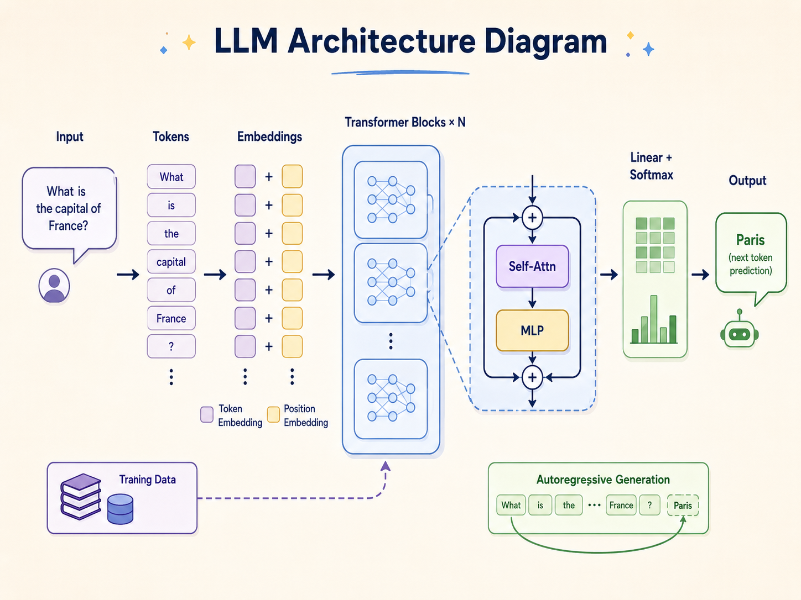

# Mango-LLM
> Mango-LLM: a transformer language model built entirely from scratch


Mango-LLM is a custom GPT-style causal language model implemented entirely from scratch. It is not based on any pretrained foundational models. The model was trained from initialization on the TinyStories dataset and features a working Gradio web demo. Pre-trained checkpoints are hosted on the Hugging Face Hub.

## Table of Contents
- [Architecture](#architecture)
- [Results](#results)
- [Project Structure](#project-structure)
- [Getting Started](#getting-started)
- [Training Pipeline](#training-pipeline)
- [Tech Stack](#tech-stack)
- [License](#license)
- [Author](#author)

## Architecture


*Simplified architecture overview (Note: this is a simplified illustration — our implementation uses two separate residual connections per transformer block with pre-norm LayerNorm, rather than the single wrapped skip connection shown).*

**Model Specifications:**
- **Vocabulary Size:** 8000 (Custom BPE tokenizer)
- **Embedding Dimension:** 1024
- **Attention Heads:** 16
- **Transformer Layers:** 20
- **Context Length (Block Size):** 512 tokens
- **Total Parameters:** ~268M (268,781,376)

## Results

Perplexity is a measure of how well a probability model predicts a sample; a lower perplexity indicates the model is less "surprised" by the evaluation text. The comparison below is fair as both models were evaluated on the exact same held-out validation subset of the TinyStories dataset using their respective native tokenizers.

| Model | Perplexity |
|-------|------------|
| Mango-LLM | 6.81 |
| GPT-2-medium (zero-shot) | 8.80 |

## Project Structure

```text
Mango-LLM/
├── data/                           # Data processing, datasets, and tokenization
│   ├── __init__.py                 # Exposes get_batch, vocab_size, and tokenizer methods
│   ├── bpe_tokenizer.py            # Custom Byte-Pair Encoding tokenizer trainer
│   ├── data.py                     # Dataloader utilities
│   ├── download_data.py            # Script to fetch datasets
│   ├── prepare_data.py             # Data preprocessing script
│   ├── tokenizer.py                # Runtime Tokenizer interface
│   ├── input.txt                   # Raw downloaded text corpus
│   ├── tinystories.txt             # Primary text dataset
│   ├── tinystories_bpe.json        # Trained BPE tokenizer rules
│   ├── tokens.bin                  # Binary array of token IDs
│   └── tokens.meta                 # Metadata for tokens.bin
├── docs/                           # Documentation and diagrams
│   └── architecture-diagram.png    
├── evaluation/                     # Model testing and benchmarking
│   ├── evaluate.py                 # Mango-LLM evaluation script
│   └── evaluate_gpt2_baseline.py   # Baseline evaluation against GPT-2
├── model/                          # Core neural network math
│   ├── __init__.py                 
│   └── model.py                    # Transformer architecture definitions
├── training/                       # Scripts that run the optimization loops
│   ├── train.py                    # Standard local training script
│   └── train_colab.py              # Colab-optimized mixed-precision training script
├── app.py                          # Gradio web interface
├── generate.py                     # Text generation script
├── index.html                      # Frontend HTML for demo
└── README.md                       # Project documentation
```

## Getting Started

1. **Clone the repository:**
   ```bash
   git clone https://github.com/Adarsh52236/Mango-LLM.git
   cd Mango-LLM
   ```

2. **Set up a virtual environment:**
   ```bash
   python -m venv venv
   # On Windows:
   venv\Scripts\activate
   # On macOS/Linux:
   source venv/bin/activate
   ```

3. **Install dependencies:**
   ```bash
   pip install torch gradio huggingface_hub supabase
   ```

4. **Run the web demo locally:**
   ```bash
   python app.py
   ```

## Training Pipeline

The repository provides a complete end-to-end pipeline to train the model from scratch:

1. **Tokenize:** Train a custom BPE tokenizer on the dataset (`bpe_tokenizer.py`).
2. **Prepare Data:** Process and split the raw text into binary tokens (`prepare_data.py`).
3. **Train:** Train the model architecture on the processed data (`train.py` or `train_colab.py` for mixed-precision GPU training).
4. **Evaluate:** Measure the model's perplexity on the validation split (`evaluate.py`).
5. **Generate:** Use the trained model to autoregressively generate new text (`generate.py`).

## Tech Stack
- PyTorch
- Gradio
- Supabase
- Hugging Face Hub

## License
This project is licensed under the MIT License.

## Author
Adarsh Khot (Adarsh52236)